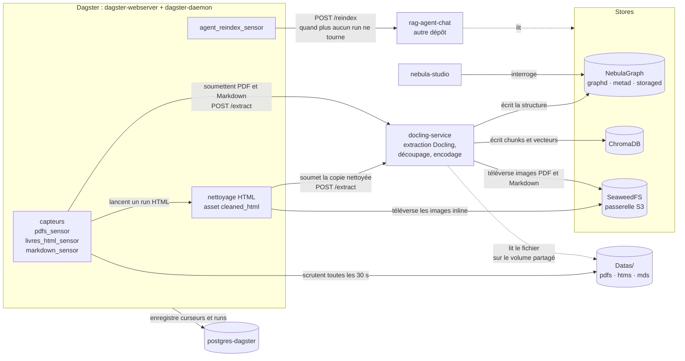

# RAG Assistant Pipeline

Pipeline d'ingestion : il lit des livres techniques (PDF, HTML, Markdown)
déposés dans `Datas/` et alimente trois stores, NebulaGraph (la structure),
ChromaDB (les vecteurs) et SeaweedFS (les images). Les questions sont traitées
par un autre dépôt, [`rag-agent-chat`](https://github.com/floSa/rag-agent-chat).

## Architecture


```mermaid
flowchart LR
    DATAS[("Datas/<br/>pdfs · htms · mds")]

    subgraph DAG["Dagster : dagster-webserver + dagster-daemon"]
        CAPT["capteurs<br/>pdfs_sensor<br/>livres_html_sensor<br/>markdown_sensor"]
        NET["nettoyage HTML<br/>asset cleaned_html"]
        REIDX["agent_reindex_sensor"]
    end

    PG[("postgres-dagster")]
    DOC["docling-service<br/>extraction Docling,<br/>découpage, encodage"]

    subgraph STORES["Stores"]
        NEB[("NebulaGraph<br/>graphd · metad · storaged")]
        CHR[("ChromaDB")]
        SW[("SeaweedFS<br/>passerelle S3")]
    end

    STUDIO["nebula-studio"]
    AGENT["rag-agent-chat<br/>autre dépôt"]

    CAPT -->|"scrutent toutes les 30 s"| DATAS
    CAPT -->|"lancent un run HTML"| NET
    NET -->|"téléverse les images inline"| SW
    NET -->|"soumet la copie nettoyée<br/>POST /extract"| DOC
    CAPT -->|"soumettent PDF et Markdown<br/>POST /extract"| DOC
    DOC -.->|"lit le fichier<br/>sur le volume partagé"| DATAS
    DOC -->|"écrit la structure"| NEB
    DOC -->|"écrit chunks et vecteurs"| CHR
    DOC -->|"téléverse images PDF et Markdown"| SW
    DAG -->|"enregistre curseurs et runs"| PG
    REIDX -->|"POST /reindex<br/>quand plus aucun run ne tourne"| AGENT
    AGENT -.->|"lit"| STORES
    STUDIO -->|"interroge"| NEB
```

Seuls Dagster (`localhost:3002`) et Nebula Studio (`localhost:7001`) sont
publiés sur l'hôte.

## Configuration minimale

- processeur : 2 vCPU x86-64 ;
- mémoire : 12 Gio ;
- disque : 30 Go libres ;
- GPU : non requis ; VRAM : aucune.

Détail, recommandé et origine des chiffres :
[`documentation/configuration_requise.md`](documentation/configuration_requise.md).

## Démarrer

```bash
cp .env.example .env
```

```bash
docker compose up -d --build
```

```bash
docker compose ps
```

Remplir le `.env` avant le deuxième geste
([`livraison.md` §2.2](documentation/livraison.md#22-le-env--toutes-les-variables)).
Un fichier déposé dans `Datas/pdfs/`, `Datas/htms/` ou `Datas/mds/` est vu dans
les 30 s par `pdfs_sensor`, `livres_html_sensor` ou `markdown_sensor` ; pour
réingérer un fichier inchangé, poser le marqueur `reingerer:<étiquette>` sur le
curseur du capteur
([§3.2](documentation/livraison.md#32-réingérer--le-marqueur-sur-le-curseur)).

## Documentation

- [`livraison.md`](documentation/livraison.md) : la référence d'exploitation
  (variables, démarrage, ingestion, purge, vérification, retour arrière).
- [`architecture.md`](documentation/architecture.md) : services, ports et
  décisions d'architecture.
- [`guide_du_depot.md`](documentation/guide_du_depot.md) : ajouter une source,
  structure du dépôt, tests et garde-fous.
- [`configuration_requise.md`](documentation/configuration_requise.md) :
  ressources et logiciels nécessaires.
- Fiches par sujet : [`services/`](documentation/services/),
  [extraction](documentation/extraction_donnees.md),
  [graphe](documentation/graphe_connaissances.md),
  [index vectoriel](documentation/base_vectorielle.md),
  [stockage d'objets](documentation/stockage_objets.md),
  [orchestration](documentation/orchestration.md),
  [sécurité](documentation/SECURITY.md),
  [contrat avec l'agent](documentation/llm_integration_plan.md),
  [stratégie d'évaluation](documentation/rag_evaluation_strategy.md).
- Archives, non réécrites : [`campagnes/`](documentation/campagnes/) (comptes
  rendus de mesure), [registre](documentation/axes_amelioration.md),
  [pilotage](documentation/pilotage_du_chantier.md),
  [état des lieux](documentation/etat_des_lieux.md),
  [changements](documentation/CHANGEMENTS.md).
