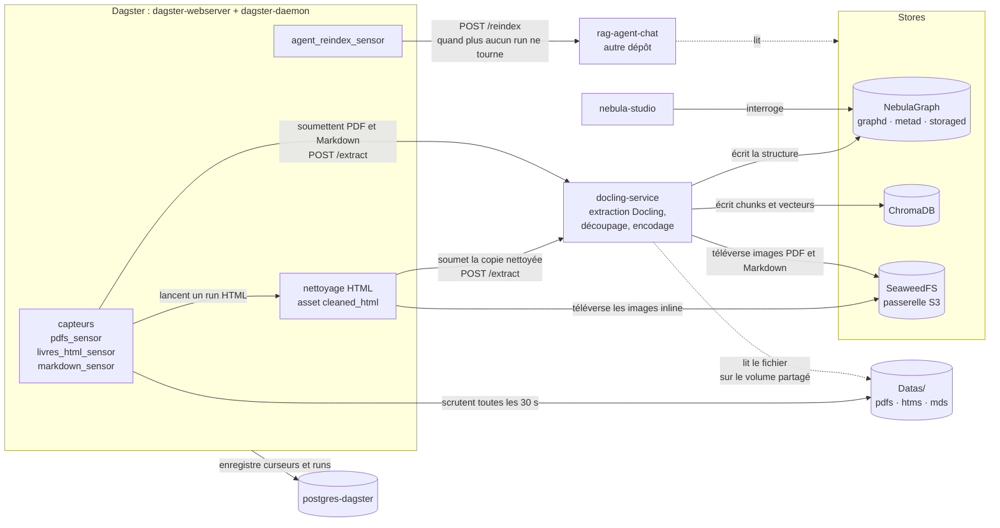

# RAG Assistant Pipeline

Pipeline d'ingestion : il lit des livres techniques (PDF, HTML, Markdown) déposés
dans `Datas/` et en produit trois stores, un **graphe** (NebulaGraph, la
structure), un **index vectoriel** (ChromaDB, la recherche par le sens) et un
**stockage d'objets** (SeaweedFS, les images). Il ne répond à aucune question :
ce rôle est celui de [`rag-agent-chat`](https://github.com/floSa/rag-agent-chat),
un autre dépôt qui lit ces stores.

## Architecture

Les dix services de `docker-compose.yml`, et l'agent de l'autre dépôt :


```mermaid
flowchart LR
    DATAS[("Datas/<br/>pdfs · htms · mds")]

    subgraph DAG["Dagster : dagster-webserver + dagster-daemon"]
        CAPT["capteurs<br/>pdfs_sensor<br/>livres_html_sensor<br/>markdown_sensor"]
        NET["nettoyage HTML<br/>asset cleaned_html"]
        REIDX["agent_reindex_sensor"]
    end

    PG[("postgres-dagster")]
    DOC["docling-service<br/>extraction Docling,<br/>découpage, encodage"]

    subgraph STORES["Stores"]
        NEB[("NebulaGraph<br/>graphd · metad · storaged")]
        CHR[("ChromaDB")]
        SW[("SeaweedFS<br/>passerelle S3")]
    end

    STUDIO["nebula-studio"]
    AGENT["rag-agent-chat<br/>autre dépôt"]

    CAPT -->|"scrutent toutes les 30 s"| DATAS
    CAPT -->|"lancent un run HTML"| NET
    NET -->|"téléverse les images inline"| SW
    NET -->|"soumet la copie nettoyée<br/>POST /extract"| DOC
    CAPT -->|"soumettent PDF et Markdown<br/>POST /extract"| DOC
    DOC -.->|"lit le fichier<br/>sur le volume partagé"| DATAS
    DOC -->|"écrit la structure"| NEB
    DOC -->|"écrit chunks et vecteurs"| CHR
    DOC -->|"téléverse images PDF et Markdown"| SW
    DAG -->|"enregistre curseurs et runs"| PG
    REIDX -->|"POST /reindex<br/>quand plus aucun run ne tourne"| AGENT
    AGENT -.->|"lit"| STORES
    STUDIO -->|"interroge"| NEB
```

`docling-service` est le seul service qui écrit dans NebulaGraph et ChromaDB ;
il convertit un document à la fois. Seuls Dagster (`localhost:3002`) et Nebula
Studio (`localhost:7001`) sont publiés sur l'hôte ; le reste ne se joint que
depuis le réseau `rag_network`. Table des services, ports et décisions :
[`documentation/architecture.md`](documentation/architecture.md).

## Ressources nécessaires

Mesurées le 27 septembre 2026, entre 05:57 et 06:05 UTC, en lecture seule, sur
la pile en service (23 documents ingérés).

**Le poste de mesure**

| Ressource | Valeur | Commande |
|---|---|---|
| processeur | 22 vCPU (AMD EPYC 9454) | `nproc`, `lscpu` |
| mémoire | 86 Gio, sans swap | `free -h` |
| GPU | un NVIDIA L4 (23 034 Mio), non attribué à la pile | `nvidia-smi -L` |
| disque | 387 Go, dont 145 Go libres | `df -h` |

**Le GPU n'est pas utilisé : l'extraction tourne sur processeur.** Le conteneur
`docling-service` n'a aucune réservation de périphérique
(`docker inspect … .HostConfig.DeviceRequests` rend `null`, runtime `runc`), et
`torch.cuda.is_available()` y rend `False`. La réservation GPU vit dans
`docker-compose.gpu.yml`, à superposer volontairement
([`documentation/services/docling.md`](documentation/services/docling.md)).

**Mémoire et processeur au repos** (`docker stats --no-stream`, second de deux
relevés à 20 s d'écart) :

| Conteneur | CPU | Mémoire |
|---|---|---|
| `docling-service` (modèles chargés) | 0,16 % | 2,37 Gio (limite 10 Gio) |
| `dagster-daemon` | 8,0 % | 418 Mio |
| `dagster-webserver` | 3,5 % | 277 Mio |
| `chromadb` | 0,2 % | 242 Mio |
| `seaweedfs` | 0,0 % | 222 Mio |
| `metad` | 0,4 % | 89 Mio |
| `storaged` | 0,4 % | 85 Mio |
| `postgres-dagster` | 12,9 % | 70 Mio |
| `graphd` | 0,1 % | 66 Mio |
| `nebula-studio` | 0,3 % | 57 Mio |
| **total** (`calculé`) | environ 0,26 vCPU | **3,9 Gio** |

Les pourcentages de processeur se lisent par cœur : 12,9 % est un huitième d'un
vCPU. L'activité de `dagster-daemon` et de `postgres-dagster` au repos vient des
capteurs, qui scrutent le corpus toutes les 30 s.

**Disque**

| Élément | Taille | Commande |
|---|---|---|
| NebulaGraph (`Datas/database/nebula/`) | 293 Mo (meta 112, storage 182) | `du -sh` |
| ChromaDB (`Datas/database/chromadb/`) | 143 Mo | `du -sh` |
| Postgres Dagster (`Datas/database/postgres/`) | 145 Mo | `du -sh` dans le conteneur (répertoire illisible depuis l'hôte) |
| SeaweedFS (`Datas/database/seaweedfs/`) | 31 Mo | `du -sh` dans le conteneur |
| HTML nettoyé (`Datas/.cleaned/`) | 2,4 Mo | `du -sh` |
| corpus en service (`Datas/pdfs/`, `Datas/htms/`) | 56 Mo | `du -sh` |
| cache des modèles (volume `docling_models`) | 652 Mo | `docker system df -v` |
| images Docker de la pile | 14,8 Go au plus, dont 10,4 Go pour `docling-service` (PyTorch CUDA) | `docker images` (somme `calculée`, couches partagées comptées deux fois) |

**Durée d'une réingestion complète** : **387 s** de mur pour les 23 documents
(23 runs, 665 s cumulées), le 25 septembre 2026, sur ce poste, sans GPU.
Détail :
[`documentation/campagnes/2026-09-25-deuxieme-campagne-de-reference.md`](documentation/campagnes/2026-09-25-deuxieme-campagne-de-reference.md), §3.

**Minimum recommandé** (`calculé`) :

- **mémoire : 16 Gio.** La limite de `docling-service` (10 Gio, fixée par
  `docker-compose.yml`) plus les neuf autres services au repos (1,5 Gio) font
  11,5 Gio ; la marge d'environ 40 % couvre le système et les pics des runs
  Dagster, qui ne sont pas mesurés ;
- **disque : 30 Go libres.** Images, cache des modèles, stores et corpus font
  16,1 Go ; la marge, près du double, couvre le cache de construction de
  `docker compose up --build`, non mesuré pour cette pile seule, et la
  croissance des stores avec le corpus ;
- **GPU : aucun** ;
- **processeur : pas de minimum établi.** Aucune ingestion n'a été mesurée sur
  un poste plus petit ; les 387 s valent pour 22 vCPU.

## Démarrer

Prérequis : Docker et Docker Compose v2 ; Python 3.12 et
[`uv`](https://docs.astral.sh/uv/) pour la porte qualité seulement.

```bash
cp .env.example .env
```

Remplir le `.env` : chaque variable est décrite au
[§2.2 de `livraison.md`](documentation/livraison.md#22-le-env--toutes-les-variables).
`S3_ACCESS_KEY` et `S3_SECRET_KEY` n'y figurent pas : `docker-compose.yml` les
dérive de `SEAWEEDFS_RW_*`.

```bash
docker compose up -d --build
```

Sur une pile neuve seulement : sur une pile en service, nommer les services et
ajouter `--no-deps`
([§6.3](documentation/livraison.md#63-docker-compose-up-sans---no-deps-redémarre-les-dépendances)).

```bash
docker compose ps
```

`seaweedfs` et `docling-service` doivent être `healthy` ; `docling-service` a
600 s pour charger ses modèles
([§2.4](documentation/livraison.md#24-la-santé-des-services)).

## Opérations courantes

- **Ingérer** : déposer le fichier dans `Datas/pdfs/`, `Datas/htms/` ou
  `Datas/mds/` ; le capteur de sa source (`pdfs_sensor`, `livres_html_sensor`
  ou `markdown_sensor`) le voit dans les 30 s
  ([§3.1](documentation/livraison.md#31-le-chemin-nominal--un-fichier-déposé)).
- **Réingérer** un fichier inchangé : poser sur le curseur du capteur le
  marqueur `reingerer:<étiquette>`, avec une étiquette neuve à chaque fois
  ([§3.2](documentation/livraison.md#32-réingérer--le-marqueur-sur-le-curseur)).
- **Vérifier** : `uv sync && make all` pour le code, puis les sondes des stores
  en lecture seule ([§4](documentation/livraison.md#4-vérifier)).
- **Purger** : `python -m src.wipe_stores` par `docker compose run --rm --no-deps`,
  puis `docker compose restart docling-service`
  ([§3.3](documentation/livraison.md#33-la-purge-et-le-redémarrage-qui-la-suit)).

## Où lire ensuite

1. [`documentation/livraison.md`](documentation/livraison.md) : la référence
   d'exploitation (variables, démarrage, ingestion, purge, vérification, retour
   arrière, pièges, défauts connus, prochaines étapes).
2. [`documentation/guide_du_depot.md`](documentation/guide_du_depot.md) :
   ajouter une source, règles d'ingestion, structure du dépôt, tests et
   garde-fous, licences.
3. Les fiches : [architecture](documentation/architecture.md),
   [extraction](documentation/extraction_donnees.md),
   [graphe](documentation/graphe_connaissances.md),
   [index vectoriel](documentation/base_vectorielle.md),
   [stockage d'objets](documentation/stockage_objets.md),
   [orchestration](documentation/orchestration.md),
   [services](documentation/services/),
   [sécurité](documentation/SECURITY.md),
   [état des lieux](documentation/etat_des_lieux.md),
   [changements](documentation/CHANGEMENTS.md),
   [contrat avec l'agent](documentation/llm_integration_plan.md),
   [stratégie d'évaluation](documentation/rag_evaluation_strategy.md).

**Archives datées**, non réécrites, qui ne décrivent pas forcément l'état
actuel :
[`documentation/axes_amelioration.md`](documentation/axes_amelioration.md) (le
registre),
[`documentation/pilotage_du_chantier.md`](documentation/pilotage_du_chantier.md),
[`documentation/campagnes/`](documentation/campagnes/) (comptes rendus de
mesure et l'instantané des identifiants du 24 septembre 2026).
